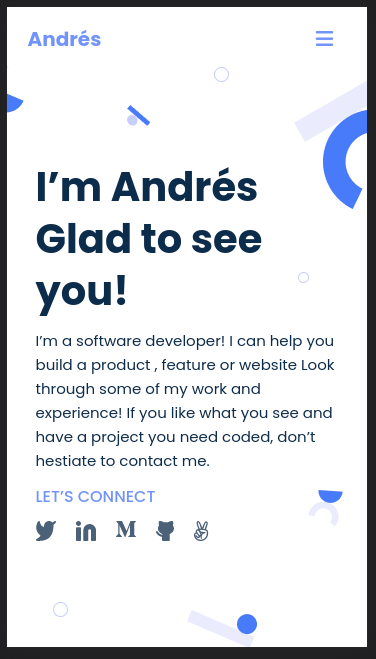

# My Portfolio

>	This is my portfolio a tool where I will be showing my work.

## Built With

- HTML and CSS

## Live Demo

[Live Demo Link](https://andres-condezo-monge-portfolio.netlify.app)

## Getting Started

- In order to see the portfolio in your browser you must click on the link "Live Demo"
- To get a local copy up and running follow these simple example steps:

### Prerequisites

No prerequisites are necessary for this project

### Setup

- Clone the repository with the command:

<code>
$ git clone https://github.com/andres-condezo/Portfolio.git
	</code>

### Usage
- Open the file named 'index.html' in your browser.

## Authors

👤 **Andrés Condezo Monge**

- GitHub: [@andres-condezo](https://github.com/andres-condezo)
- Twitter: [@andres_condezo](https://twitter.com/andres_condezo)
- LinkedIn: [andres-condezo](https://linkedin.com/in/andres-condezo)

## Contributors

👤 **Oyelakin**

- GitHub: [@Oyelakin](https://github.com/oyelaking9)

👤 **Reem janina**

- GitHub: [@Reem](https://github.com/Reem-lab)

## Show your support

Give a ⭐️ if you like this project!

## 📝 License

This project is [MIT](./MIT.md) licensed.
